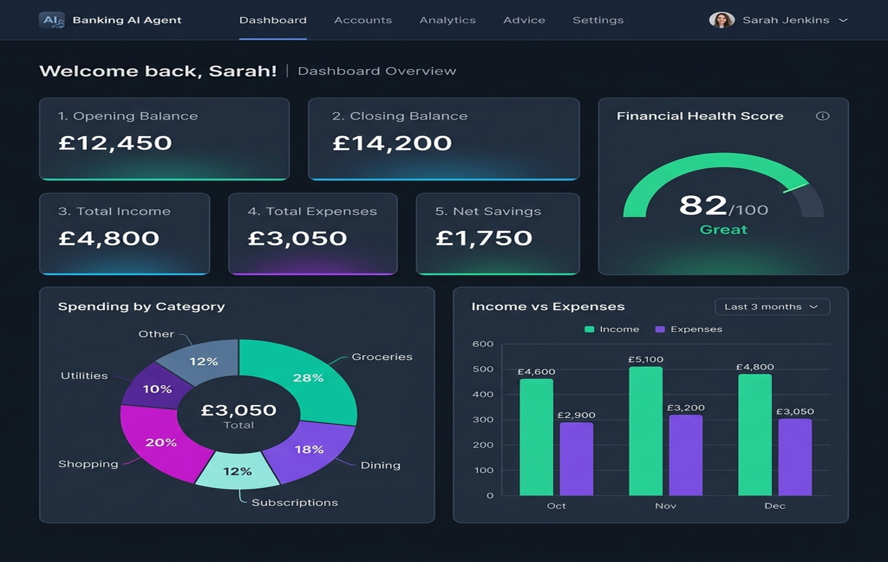
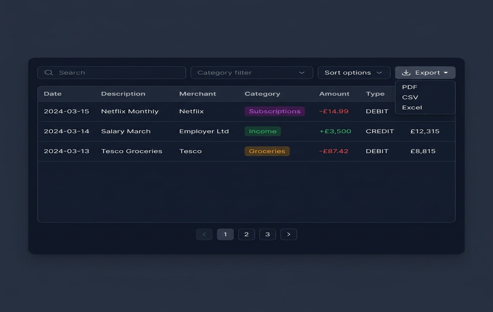
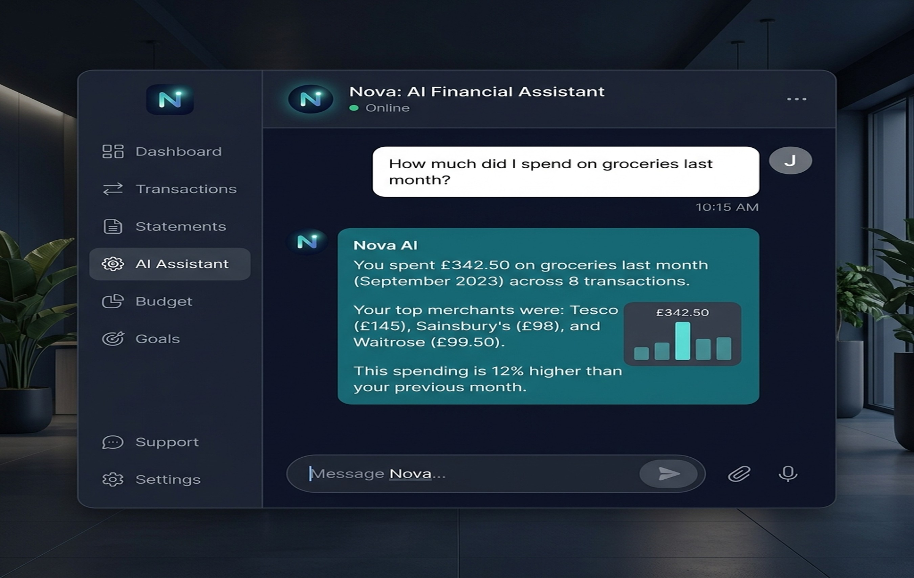
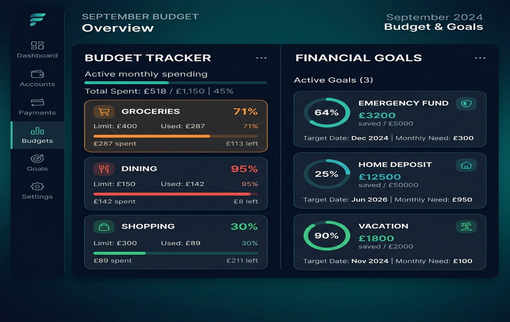

# 🏦 Banking AI Agent

An AI-powered banking analytics application that enables users to upload bank statements (PDF, CSV, XLSX, Images) and receive intelligent financial insights, transaction categorization, spending analysis, budgeting recommendations, and a personalized chat copilot. 

This application integrates **Spring Boot 3.x (Java 21)** for the backend service and **React 19 (TypeScript & Material-UI)** for a dark-mode glassmorphic frontend interface, utilizing **Google Gemini AI** for transaction categorization and conversational intelligence.

---

## 🛠️ Technology Stack

### Backend
* **Runtime**: Java 21
* **Framework**: Spring Boot 3.x
* **Build System**: Gradle & Maven support (dual-build config)
* **Security**: Spring Security + JSON Web Tokens (JWT)
* **Database & Persistence**: Spring Data JPA + H2 (in-memory dev) / PostgreSQL (prod)
* **Caching**: Redis (prod) / Simple in-memory cache (dev)
* **AI Engine**: Google Gemini API via custom HTTP client
* **Libraries**: Apache PDFBox (PDF parsing), Apache POI (Excel parsing)

### Frontend
* **Framework**: React 19 (TypeScript)
* **Build Tool**: Vite
* **UI styling**: Material-UI (MUI) with modern glassmorphism and deep dark aesthetics
* **Icons**: Lucide React
* **Charts**: Recharts & Chart.js

---

## 📸 Screen Previews & Core Features

The application features a modern, glassmorphic dark-themed interface designed for financial clarity and smooth interactive transitions. Below are previews of the primary application screens along with details of implemented features:

### 1. Financial Analytics Dashboard
The dashboard provides a visual consolidation of all imported bank statements.

* **Highlights**:
  * **6 KPI Cards**: Real-time updates for Opening Balance, Closing Balance, Total Income, Total Expenses, Net Savings, and an AI Financial Health Score.
  * **Interactive Visualizations**: Spending by Category (Pie Chart) and monthly Income vs Expenses (Bar Chart) built with Recharts.
  * **AI Health Analysis**: A detailed contextual feedback narrative generated by Google Gemini.

### 2. Transaction Management & Exports
Review, search, and manage all extracted transactions in a single paginated table.

* **Highlights**:
  * **Search & Filters**: Full-text description/merchant search and category-badge filtering.
  * **Custom Category Creation**: Define user-specific categories dynamically.
  * **Bulk Updates**: Select multiple transactions and recategorize them at once.
  * **Deduplication Safeguards**: Avoid data duplication with SHA-256 hash checks before processing.
  * **Reports Export**: Instant export of filtered data to Excel, CSV, or formatted PDF.

### 3. AI Chat Copilot ("Nova")
Converse directly with your financial statement data using plain English.

* **Highlights**:
  * **Transaction-Aware Context**: The chatbot automatically receives transactional context tailored to the authenticated user.
  * **Natural Language Queries**: Calculate totals, spot trends, or query specific merchants (e.g., *"How much did I spend at Tesco last month?"*).
  * **Persistent History**: Keeps conversation context across the session.

### 4. Budgets & Goal Tracking
Configure monthly limits and monitor progress toward custom savings goals.

* **Highlights**:
  * **Monthly Spending Limits**: Set limits for specific categories and view progress bars with warning triggers (80% yellow, 100% red).
  * **Savings Progress**: Visual circular completion indicators for named targets (e.g., Emergency Fund, Home Deposit).
  * **AI Recommendation Engines**: Gemini-powered balance forecasting and contribution recommendations.

---

## ⚙️ Prerequisites

Ensure you have the following installed on your machine:
1. **Java Development Kit (JDK) 21**
2. **Node.js (v20.12.0 or higher)**
3. **Docker & Docker Compose** (only required for PostgreSQL/Redis in production mode)

---

## 🚀 Getting Started

The project is structured as a monorepo with `backend` and `frontend` subprojects. You can run the application in two ways:
* **Development Mode**: Backend and Frontend run as separate development servers.
* **Production Package Mode**: Frontend assets are compiled and embedded directly in the Spring Boot Jar, serving as a single executable.

### Method A: Running in Development Mode (Recommended for Dev)

In development mode, the backend default profile is `dev` which uses an **in-memory H2 database** and **in-memory caching**, so no external databases or Redis instances are required to be running locally.

#### 1. Start the Backend
Navigate to the root directory and run the Gradle wrapper command to start the Spring Boot app:
```bash
./gradlew :backend:bootRun
```
*Alternatively, if using Maven:*
```bash
mvn -pl backend spring-boot:run
```
* **Backend API URL**: `http://localhost:8080`
* **H2 Database Console**: `http://localhost:8080/h2-console`
  * **JDBC URL**: `jdbc:h2:mem:banking_db`
  * **Username**: `sa`
  * **Password**: *(leave blank)*

#### 2. Start the Frontend
Open a new terminal window, navigate to the `frontend` directory, install dependencies, and start the Vite development server:
```bash
cd frontend
npm install
npm run dev
```
* **Frontend Dev URL**: `http://localhost:5173`
* Vite is configured to proxy all API requests starting with `/api` to `http://localhost:8080`.

---

### Method B: Running in Production Mode (PostgreSQL + Redis)

In production mode, the application connects to a PostgreSQL database and uses Redis for caching.

#### 1. Start PostgreSQL & Redis Services
From the root directory, spin up the required Docker containers:
```bash
docker compose up -d
```
*This starts a PostgreSQL instance on host port `5433` (db: `banking_db`, user: `postgres`, password: `password`) and a Redis instance on port `6379`.*

#### 2. Start the Backend with `prod` profile
Run the backend with the `prod` active profile:
```bash
./gradlew :backend:bootRun --args='--spring.profiles.active=prod'
```
*Or using Maven:*
```bash
mvn -pl backend spring-boot:run -Dspring-boot.run.profiles=prod
```

#### 3. Build & Run Frontend
Follow the development mode steps to run the frontend at `http://localhost:5173`.

---

### Method C: Single-Jar Deployment (Build & Package)

Both the Gradle and Maven build files are configured to automatically trigger the React build, bundle its static assets into the backend resource folder (`backend/src/main/resources/static`), and package them as a single deployable JAR.

#### 1. Build the Monorepo
From the root folder, execute the build:
```bash
./gradlew build
```
*Or using Maven:*
```bash
mvn clean package
```

#### 2. Run the JAR
Once compiled, run the backend package which serves both the REST endpoints and the compiled React UI on port `8080`:
```bash
java -jar backend/build/libs/backend-0.0.1-SNAPSHOT.jar
```
*Or if built with Maven:*
```bash
java -jar backend/target/backend-0.0.1-SNAPSHOT.jar
```
Open your browser and navigate to `http://localhost:8080` to access the application.

---

### Method D: Running Backend and UI Concurrently (One Command)

For quick development, a unified task is available in both Gradle and Maven to launch the Spring Boot backend (`http://localhost:8080`) and Vite dev server (`http://localhost:5173`) concurrently using a single command from the project root. *(Note: Ensure you have run `npm install` inside the `frontend` directory first).*

#### Using Gradle
Run the custom `runDev` task:
```bash
./gradlew runDev
```
*This task executes the backend `bootRun` and the frontend `npm run dev` in parallel, forwarding standard I/O to the terminal. Stopping the task (via `Ctrl+C`) automatically kills both processes.*

#### Using Maven
Run the configured `exec-maven-plugin` execution:
```bash
mvn exec:exec
```
*This executes a cross-platform command based on your OS:*
* *On **Windows**: Opens a new command window to run the Spring Boot backend while launching the Vite frontend dev server in the current console.*
* *On **Unix (Linux/macOS)**: Runs the Spring Boot backend in the background and the Vite frontend dev server in the foreground, automatically killing the background backend server when you terminate the command.*

---


## 🔑 Authentication & Sample Users

The system uses JWT-based session security. Since the database starts empty (especially in H2 in-memory mode), you will need to **Register** a new account.

1. Open the login page and click **"Register here"** at the bottom of the card.
2. Fill out the registration form. You can select either the **Standard User** or **Administrator** role.
3. Suggestion: register with the following sample credentials to test the features:

| User Type | Recommended Email | Recommended Password | Role Selectable | Features Available |
| :--- | :--- | :--- | :--- | :--- |
| **Standard User** | `user@example.com` | `password123` | `Standard User` | Upload statements, view dashboards, chat with AI, track budgets. |
| **Administrator** | `admin@example.com` | `adminpassword` | `Administrator` | All standard user features + access to the **Admin Panel** to view system audit logs. |

Once registered, log in using the credentials to access the primary application dashboard.

---

## 🤖 Google Gemini AI Configuration

The application uses Google Gemini to extract data from statements and power the financial chatbot. You have two options for managing your Gemini API Key:

1. **Global Server Key (Optional)**:
   A developer key is pre-configured in `backend/src/main/resources/application.properties` under the key `gemini.api.key`. You can replace this value in the properties file or set it as a system environment variable.
2. **Dynamic Browser-Side Key (Recommended)**:
   To ensure you have full control over rate limits, you can input your personal Gemini API Key directly into the frontend interface.
   * Log in to the application.
   * Click the **"Missing Gemini Key"** or **"Gemini Key Configured"** button in the top navigation bar.
   * Input your API key and click **Save Configuration**.
   * The key is stored locally in your browser's `localStorage` and sent with requests via the custom `X-Gemini-API-Key` HTTP header.

---

## 📁 Supported Bank Statement Formats

Navigate to the **Statements** panel to upload bank statements. The parser supports:
* **Structured Documents**: `.csv`, `.xlsx`, text-based `.pdf`
* **Scanned/Image Documents** (via Gemini Vision OCR): scanned `.pdf`, `.png`, `.jpg`, `.jpeg`

Upon successful upload, transactions will be automatically extracted, categorized (e.g., Groceries, Utilities, Subscriptions, Salary), and indexed in the transaction history table.

---

## 🗂️ Git Repository & Version Control

The project has been initialized as a Git repository and is configured with a comprehensive, root-level [`.gitignore`](file:///c:/Users/Dinesh Mallemala/workspace/banking_ai_agent/.gitignore) file.

### Ignored Artifacts
To prevent cluttering the repository with compiler outputs, downloaded dependencies, and environment files, the following are ignored:
* **Build folders**: Maven's `/target/`, Gradle's `/.gradle/` and `/build/`, and general compiler `/bin/` folders.
* **Dependencies**: Frontend `node_modules` and local downloaded Node instances (`/node/`).
* **Environment variables & credentials**: `.env`, `.env.local`, and other `*.env` files containing API keys or private database passwords.
* **OS Temp Files**: `.DS_Store`, `Thumbs.db`, and temporary PowerPoint files (e.g., prefixed with `~$`).

### Quick Commands
To verify the status of files or to check what files are being tracked/ignored by Git, run:
```bash
# Check status of tracked/untracked files
git status

# Check files ignored by the .gitignore configuration
git status --ignored
```
